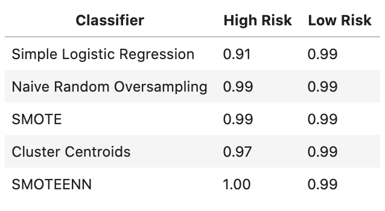
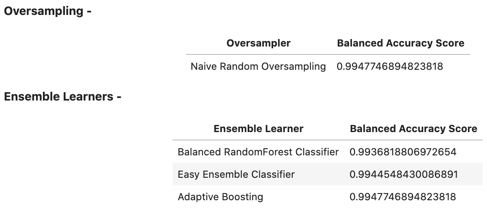

# Risky Business


*This repository contains the Unit 11 Classification homework assignment, "Risky Business"  in the FinTech bootcamp course at the University of Toronto's School of Continuing Studies.*

---

## Table of Contents

- [Project Description](#Project-Objectives)
- [Installation Requirements](#Installation-Requirements)
- [File Contents](#File-Contents)

---

## Project Objectives

The following report uses a combination of training and evaluation models with imbalanced classes in an attempt to predict credit risk. 

### Part 1: Resampling Techniques



Utilizing the Imbalanced-learn and Scikit-learn libaries, various resampling techniques are employed to evaluate imbalanced class data from the Lending Club. 

Resampling techniques explored in this notebook: 

- Simple Logisitc Regression
- Oversampling: Naive Random Oversampling & SMOTE
- Undersampling: Cluster Centroids
- Combination Sampling: SMOTEENN

### Part 2: Ensemble Learners



In this section of the assignmnet, ensemble classifiers are used to predict loan risk and to further evaluate each model. 

Ensemble learners explored in this notebook:

- Oversampling: Naive Random Oversampling
- Balanced Random Forest Classifier
- Easy Ensemble Classifier
- AdaBoost

---

## Installation Requirements

To successfully view parts 1 and 2 of the assignment deliverables; [Resampling Techniques Notebook]() and [Ensemble Learners Notebook](Emsemble_Learners_Credit_Risk_NB.ipynb), the following installations are required: 

```
pip install pandas
pip install numpy
```

---

## File Contents

- [Resampling Techniques Notebook]()
- [Ensemble Learners Notebook](Emsemble_Learners_Credit_Risk_NB.ipynb)
- [Summary of Findings](Summary_of_Findings.md)
- [Unit 11 Instructions](Unit_11_Instructions.md)

--- 