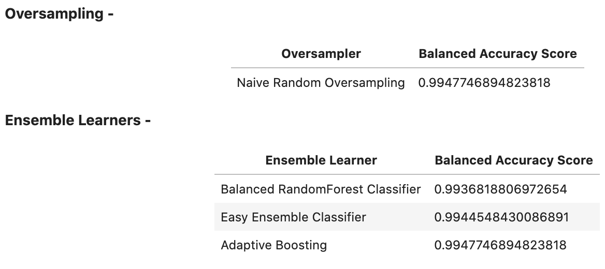

# Risky Business: Findings Summary

*This document reports a summary of the concluded findings in the Classification Unit 11 assignment.*

---

## Sections 

- [Risky Business: Resampling Techniques](#Resampling-Techniques)
- [Risky Business: Ensemble Learners](#Ensemble-Learners)

---

## Resampling Techniques

### Balanced Accuracy Score

The models with the best balanced accuracy score are SMOTE oversampling (99.48%) and Cluster Centroids undersampling (99.48%).

### Recall Score 

The model with the best recall score is SMOTEENN. However, both oversampling models; Naive Random Oversampling and SMOTE have high recall scores as well.

### Geometric Mean Score

The best geometric mean score are the oversmapling models; Naive Random Oversampling and SMOTE.

---

## Ensemble Learners

### Balanced Accuracy Score

The models with the best balanced accuracy score are the Niave Random Oversampling classifier and the Adaptive Boosting esemble learner.

### Recall Score 

All models have an equal recall score.

### Geometric Mean Score

All models have an equal geometric mean score.

### Top 3 Features

---

